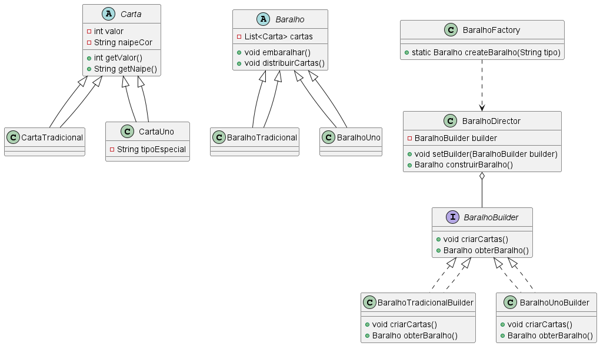
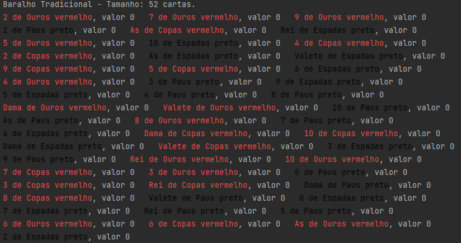

<h1 align="center" style="font-weight: bold;">Deck Builder 🏗️🃏</h1>

<p align="center"><i>Este projeto aborda a construção de diferentes tipos de baralhos de cartas usando os padrões de projeto Builder e Simple Factory. O objetivo é fornecer uma estrutura flexível para a criação de baralhos de cartas, permitindo a fácil extensão para jogos como Uno, Blackjack, Poker, entre outros.</i></p>


## 📖 Índice
1. [✔️️ Objetivos](#-objetivos)
3. [🚀 Execução e Utilização](#-execução-e-utilização)
4. [🚧 Desafios e Dificuldades](#-desafios-e-dificuldades)
5. [👥 Contribuidores](#-contribuidores)

## ️ ✔️ Objetivos

- Implementar uma solução que permita a criação de diferentes tipos de baralhos, como o baralho tradicional e o baralho Uno.
- Utilizar padrões de projeto para fornecer uma abstração comum para os diferentes tipos de baralhos.
- Preservar os princípios SOLID e GRASP para garantir um design OO robusto.


---

## 🚀 Execução e Utilização

### Pré-requisitos

Certifique-se de que os seguintes itens estão instalados em seu ambiente:

- [Java JDK 11+](https://www.oracle.com/java/technologies/javase-jdk11-downloads.html)
- [Maven](https://maven.apache.org/install.html) (opcional)
- Um IDE de sua escolha (como [Eclipse](https://www.eclipse.org/ide/) ou [IntelliJ IDEA](https://www.jetbrains.com/idea/))

### Como Executar

1. **Clonar o Repositório**:

   Clone o repositório para sua máquina local usando o Git:

   ```bash
   git clone https://github.com/oliviaoliva/AtividadePadroesBaralho.git
   cd AtividadePadroesBaralho

2. **Compilar o Projeto**
3. **Executar a Classe Principal**
4. **Exemplo de saída**: 

## 🚧 Desafios e Dificuldades

1. Entender como aplicar o Builder dentro do problema de forma coerente
2. Realizar o Diagrama de Classes antes da execução do projeto.
3. Realizar debugging e corrijir erros durante desenvolvimento.

## 👥 Contribuidores

<table>
  <tr>
    <td align="center">
      <a href="https://github.com/oliviaoliva" title="GitHub">
        <br>
        <sub>
          <b>Olivia Oliva</b>
        </sub>
      </a>
    </td>
  </tr>
</table>

---
Versão 1.0